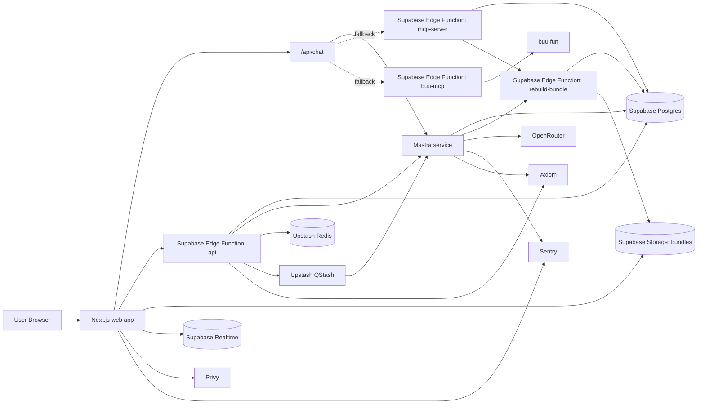
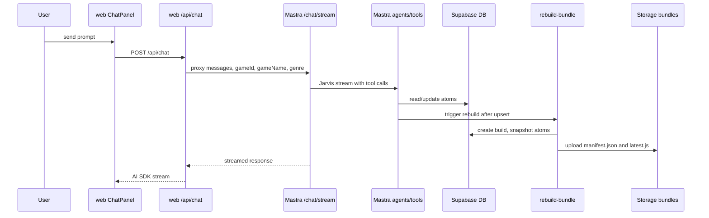
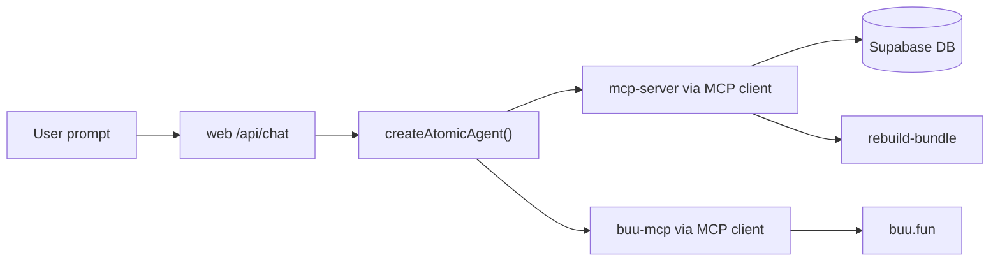
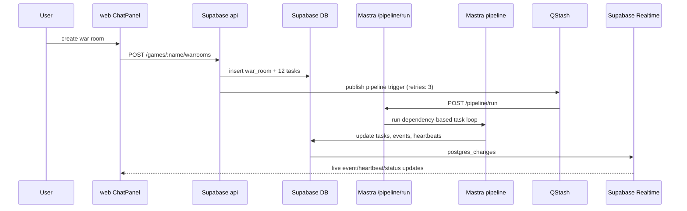
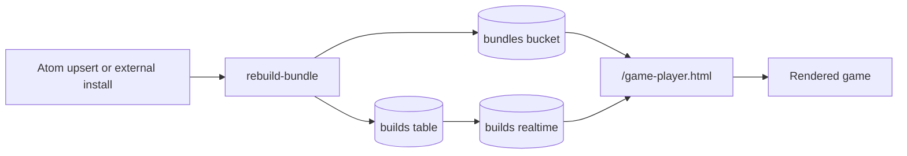
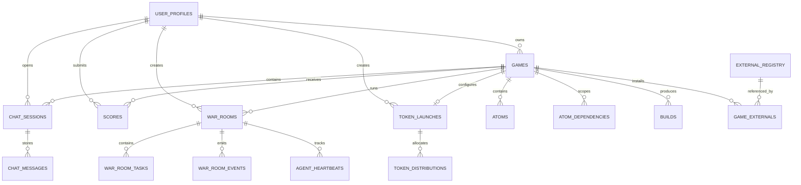

# System Architecture

> This document is the canonical architecture reference for the repository as of March 9, 2026.
> When code, schemas, routes, or orchestration behavior change, update this file first.

## Purpose

This repository contains the current implementation of an AI-native game development platform built around database-stored code units called atoms.

Two names are used across the repo:

- **Atomic Coding** is the internal architecture label: atoms, MCP, rebuild pipeline, Supabase schema, and the repository itself.
- **Buu AI Game Maker** is the current product label used in the web UI, prompts, and some deployment-facing surfaces.

In this document, `Atomic Coding` refers to the technical architecture and `Buu AI Game Maker` refers to the product experience built on top of it.

## Current-State Summary

- Code is stored in Supabase as atom records, not as source files on disk.
- The primary product surface is the Next.js app in `web/`.
- The primary orchestration surface is the Mastra service in `mastra/`.
- Supabase provides PostgreSQL, Storage, Realtime, and five active Edge Functions.
- Game bundles are generated into Supabase Storage as `manifest.json`, `latest.js`, and versioned bundle files.
- The current primary chat/orchestration path is Mastra-first.
- A secondary local chat fallback still exists inside `web/src/app/api/chat/route.ts`.
- Privy provides user identity, OpenRouter provides LLMs, embeddings, and Pixel image generation, and buu.fun provides generated 3D assets.
- Upstash Redis provides server-side caching and rate limiting; QStash provides reliable job delivery with retries.
- Sentry tracks errors across web and Mastra; Axiom collects structured logs.
- All request body validation uses Zod schemas.

## Topology

## Repository Ownership

| Area | Role | Notes |
|---|---|---|
| `web/` | Product UI and browser entrypoint | Next.js app, auth gating, workspace, public play pages, chat proxy, game iframe |
| `mastra/` | Primary agent orchestration service | Hosts Jarvis, Forge, Pixel, Checker; runs chat streaming and war-room pipeline |
| `supabase/` | Durable backend boundary | Schema, Edge Functions, MCP servers, build pipeline, storage contract |
| `frontend/` | Legacy reference artifact | Older standalone player, not the active app |
| `openclaw/` | Legacy reference artifact | Historical agent workspace docs superseded by Mastra |

## Runtime Components

### `web/`

The Next.js app is the user-facing control plane.

Primary responsibilities:

- Auth-gated workspace and game management UI
- Public play route and leaderboard route
- Chat session UI and persistence with SWR client-side caching
- War-room UI with live progress via Supabase Realtime (postgres_changes)
- Browser-side score submission listener
- Server-side `/api/chat` proxy with Mastra-first routing
- React error boundaries around major UI regions (chat, war room, game frame, config)

Key entrypoints:

- `/` lists games
- `/games/[name]` renders the main workspace
- `/play/[slug]` renders the public player
- `/games/[name]/board` renders the leaderboard
- `/games/[name]/token` renders token draft status
- `/api/chat` proxies chat to Mastra or a local fallback agent
- `/game-player.html` is the runtime iframe/player shell

Auth model:

- `web/src/middleware.ts` treats `/login`, `/play/*`, `/game-player.html`, `/api/*`, and `/games/[name]/board` as public.
- Protected app routes depend on a Privy cookie.
- `/api/chat` verifies a bearer token with the server-side Privy client before handling chat.

Client-side data layer:

- SWR (`swr-provider.tsx`) provides global caching, request deduplication, and stale-while-revalidate semantics.
- Custom hooks in `web/src/lib/hooks/` wrap `api.ts` functions: `useGames`, `useGame`, `useStructure`, `useBuilds`, `useExternals`, `useRegistry`, `useLeaderboard`, `useWarRooms`, `useChatSessions`.
- Mutations (create, delete, install, etc.) remain as direct API calls that call `mutate()` to revalidate the SWR cache.

### `mastra/`

Mastra is the current primary agent backend.

Primary responsibilities:

- Streaming chat via Jarvis at `/chat/stream`
- Non-stream generation via `/chat/generate`
- War-room pipeline execution via `/pipeline/run`
- Agent hosting for `jarvis`, `forge`, `pixel`, and `checker`
- Supabase-backed war-room state transitions and heartbeats
- Final rebuild triggering after successful war-room completion

Current agent roles:

- `jarvis`: orchestration, planning, delivery, follow-up prompts
- `forge`: atom implementation and mutation
- `pixel`: OpenRouter-backed visual asset generation for HUD, menus, sprites, textures, and other polish-layer assets
- `checker`: validation and QA

Reference:

- See [agent-role-skill-matrix.md](agent-role-skill-matrix.md) for the current role analysis, task ownership, and recommended skill emphasis for each live Mastra agent.

Important implementation detail:

- Mastra agents do **not** call the Supabase MCP server directly.
- They use a local tool layer in `mastra/src/tools/supabase.ts`.
- That local tool layer currently wraps only `get-code-structure`, `read-atoms`, and `upsert-atom`.
- The Supabase MCP server exposes a broader six-tool surface for MCP clients.
- Pixel also has a dedicated local tool layer in `mastra/src/tools/pixel.ts`.
- That tool layer exposes `generate-polished-visual-pack` plus read-only code-inspection tools so Pixel can inspect gameplay context before generating assets.
- The image model is selected through `OPENROUTER_IMAGE_MODEL`; the checked-in default is `google/gemini-3.1-flash-image-preview`, and it can be pointed at a Nano Banana-class OpenRouter image model without code changes.

### `supabase/`

Supabase is the durable system-of-record layer.

Primary responsibilities:

- PostgreSQL schema for games, atoms, builds, externals, chat, users, scores, tokens, and war rooms
- Edge Function API boundary
- MCP server hosting
- Bundle generation and storage publication
- Realtime updates for `builds`, `war_rooms`, `war_room_events`, and `agent_heartbeats`

Active Edge Functions:

| Function | Role |
|---|---|
| `api` | Main REST API, SSE stream, game-scoped CRUD, war-room creation |
| `mcp-server` | Game-scoped MCP server for atoms and externals |
| `buu-mcp` | MCP proxy for buu.fun generation APIs |
| `rebuild-bundle` | Atom snapshotting, topological bundling, manifest generation, storage upload |
| `warroom-orchestrator` | Thin proxy to Mastra that exists in repo but is not on the current primary API path |

Important deployment detail:

- `supabase/config.toml` sets `verify_jwt = false` for all configured Edge Functions.
- Application-level auth is enforced by a `requireAuth()` Hono middleware on all user-facing mutation routes (POST/PUT/DELETE for games, atoms, externals, builds, publishing, tokens, chat sessions, and war room creation/cancellation).
- Read-only routes (GET), public routes (`/public/*`), and service-to-service routes (heartbeat, task status updates from Mastra) remain unauthenticated.
- Score submissions use inline `verifyAuthToken` to extract the user ID for the score record.
- All POST/PUT request bodies are validated with Zod schemas (`_shared/schemas.ts`) before processing.
- Rate limiting (via Upstash) is applied to score submissions, war room creation, build triggers, and chat saves.

## Request Flows

### Interactive Chat and Edit Path

The current chat UI uses Mastra when `MASTRA_SERVER_URL` is configured.

Current behavior:

- Chat history is persisted through the Supabase API as sessions and messages.
- Genre context is resolved before proxying chat.
- The browser persists only unsaved message deltas after the assistant finishes or status returns to ready.

### Local Chat Fallback Path

If `MASTRA_SERVER_URL` is not configured, `/api/chat` falls back to a local Vercel AI SDK `ToolLoopAgent`.

Fallback characteristics:

- It opens MCP clients directly from the Next.js server runtime.
- It connects to `mcp-server` using `x-game-id`.
- It connects to `buu-mcp` using `x-buu-api-key`.
- It is a valid execution path, but it is secondary to the Mastra path.

### War-Room Orchestration Path

The current UI creates war rooms directly through the Supabase API.

Important current-state details:

- The API triggers Mastra via QStash (reliable webhook queue with 3 retries and DLQ). Falls back to direct fetch when QStash is not configured.
- The `warroom-orchestrator` Edge Function exists, but the main API path does not call it.
- The current `ChatPanel` creates war rooms through `createWarRoom()` in `web/src/lib/api.ts`, not through the `/api/chat` war-room branch.
- `/api/chat` still contains a war-room mode, but it is not the primary current UI path.
- When users pick asset references in chat, the current `ChatPanel` appends those references into the war-room prompt so Pixel receives art-direction and polish cues during tasks 7 and 8.

### Pixel Asset Generation Path

Pixel now has a direct image-generation path inside Mastra rather than only returning text metadata.

Current behavior:

- `mastra/src/agents/pixel.ts` uses the shared Pixel system prompt plus a dedicated tool bundle.
- `mastra/src/tools/pixel.ts` calls OpenRouter `chat/completions` with image modalities enabled.
- `generate-polished-visual-pack` accepts pack-level art direction, per-asset briefs, aspect ratio, resolution tier, transparency preference, polish goals, and reference notes.
- The tool currently returns remote image URLs from the provider response, not persisted CDN URLs and not local base64 sprite sheets.
- Pixel prompt rules explicitly emphasize gameplay readability, stateful UI, safe text zones, contrast, consistent palettes, and motion/feedback cues.

Current limitations:

- Generated assets are not yet copied into Supabase Storage or R2.
- The pipeline does not yet validate asset loadability or preview outputs in the UI.
- The current war-room reference handoff is prompt-based, not structured database metadata.

### Build and Playback Path

Runtime details:

- Rebuilds are triggered by atom mutations, external install/uninstall, and boilerplate seeding.
- The bundle is uploaded to:
  - `bundles/<game.name>/latest.js`
  - `bundles/<game.name>/build_<buildId>.js`
  - `bundles/<game.name>/manifest.json`
- The player fetches `manifest.json` first, loads externals, then fetches `latest.js`.
- The player subscribes to successful `builds` updates and reloads on new successful builds.

### Score Submission and Leaderboard Path

Score path:

1. Game code emits `window.parent.postMessage({ type: "SCORE_UPDATE", score })`.
2. `ScoreListener` in the parent window debounces submissions.
3. The listener calls `POST /games/:name/scores`.
4. The API verifies the Privy bearer token and writes to `scores`.
5. The leaderboard page reads `GET /games/:name/leaderboard`, which calls the `get_game_leaderboard` database function.

Publishing dependency:

- A game cannot be published unless the active build passes score-system validation.

## Service Catalog

### Supabase API Surface

Route groups exposed by `supabase/functions/api/index.ts`:

| Route group | Purpose |
|---|---|
| `/users/profile*` | User profile upsert and retrieval |
| `/boilerplates*` | Genre boilerplate listing and retrieval |
| `/games` and `/games/:name` | Game creation, listing, retrieval |
| `/public/games*` | Public published-game retrieval |
| `/registry/externals` | Curated external registry |
| `/games/:name/structure` | Atom map without source code |
| `/games/:name/atoms/*` | Read, search, upsert, delete atoms |
| `/games/:name/externals*` | List, install, uninstall externals |
| `/games/:name/builds*` | List builds, trigger rebuild, rollback |
| `/games/:name/publish` and `/unpublish` | Public publishing state |
| `/games/:name/scores` and `/leaderboard` | Score write and leaderboard read |
| `/games/:name/token*` | Token draft and distribution reads |
| `/games/:name/chat/sessions*` | Chat session and message persistence |
| `/games/:name/warrooms*` | War-room CRUD, SSE, heartbeat, task status |

### Mastra HTTP Surface

Routes exposed by `mastra/src/index.ts`:

| Route | Method | Purpose |
|---|---|---|
| `/chat/stream` | `POST` | Streaming Jarvis chat |
| `/chat/generate` | `POST` | Non-streaming generation with any agent |
| `/pipeline/run` | `POST` | Fire-and-forget war-room pipeline trigger |
| `/health` | `GET` | Health check and active agent list |

### MCP Surface

#### `mcp-server`

Transport:

- Streamable HTTP
- Game-scoped through the `x-game-id` request header

Current tools:

| Tool | Purpose |
|---|---|
| `get_code_structure` | Atom map plus installed externals summary |
| `read_atoms` | Full atom source and metadata |
| `semantic_search` | Vector search over atoms |
| `read_externals` | API surface of installed externals |
| `upsert_atom` | Create/update atoms and trigger rebuild |
| `delete_atom` | Delete atoms if no dependents exist |

#### `buu-mcp`

Transport:

- Streamable HTTP
- Authenticated through `x-buu-api-key`

Current tools:

| Tool | Purpose |
|---|---|
| `generate_model` | Request a 3D model from buu.fun |
| `generate_world` | Request a 3D world/environment from buu.fun |

### Browser Runtime Contract

The player defines `window.GAME` before bundle code runs.

Current contract areas:

- `window.GAME.inputs`
- `window.GAME.mouse`
- `window.GAME.time`
- `window.GAME.canvas`
- `window.GAME.tick()`
- `window.GAME.stopLoop()`
- key helper functions such as `isKeyDown`

Score reporting contract:

- Games report score through `window.parent.postMessage({ type: "SCORE_UPDATE", score })`.
- The parent app consumes that event, not the iframe itself.

### Storage Contract

Per published build output:

- `manifest.json` lists externals, bundle URL, and build timestamp.
- `latest.js` is the active bundle path consumed by the player.
- `build_<buildId>.js` is the immutable versioned archive for that build.

## Data Model

### Core Domain Tables

| Table | Purpose |
|---|---|
| `games` | Root aggregate for each game/workspace |
| `atoms` | Atom source, interface metadata, embeddings, versioning |
| `atom_dependencies` | Dependency edges between atoms per game |
| `builds` | Build status, bundle URL, logs, snapshots, score-system report |
| `external_registry` | Global curated library registry |
| `game_externals` | Per-game installed externals |

### Collaboration and Identity Tables

| Table | Purpose |
|---|---|
| `user_profiles` | Privy-linked user identity record |
| `chat_sessions` | Per-game chat threads |
| `chat_messages` | Persisted message parts for a session |
| `war_rooms` | Multi-agent orchestration run |
| `war_room_tasks` | Fixed 12-task pipeline state |
| `war_room_events` | Append-only event stream for SSE |
| `agent_heartbeats` | Liveness/status per agent per war room |

### Gameplay and Monetization Tables

| Table | Purpose |
|---|---|
| `scores` | Score submissions |
| `token_launches` | Token launch draft/config |
| `token_distributions` | Future leaderboard/token allocation records |
| `genre_boilerplates` | Seed atoms, externals, and prompts by genre |

### Entity Relationship View

## Operational Behavior

### Rebuild Triggers

Rebuilds are triggered by:

- atom upsert through the Supabase API service layer
- atom upsert through Mastra local tools
- atom upsert through the MCP server
- external install/uninstall
- boilerplate seeding after game creation
- successful war-room completion final rebuild

### Bundle Construction Rules

`rebuild-bundle` performs the following:

1. Creates a `builds` row with `status = building`
2. Snapshots current atoms and dependencies for rollback
3. Validates score-system compliance
4. Topologically sorts atoms
5. Concatenates them into an IIFE bundle
6. Picks an entrypoint in this order:
   - `game_loop`
   - `main`
   - last `core` atom in sorted order
7. Uploads bundle and manifest to the `bundles` bucket
8. Marks the build successful and updates `games.active_build_id`

### Score-System Enforcement

The score system is enforced in multiple places:

- Prompts require `score_tracker` semantics
- Deterministic validation checks:
  - `score_tracker` exists
  - it exposes numeric output `score`
  - it emits `SCORE_UPDATE`
  - at least one `core` or `feature` atom depends on it
- Build rows persist the score-system validation result
- Publishing blocks games whose active build is not score-system compliant

### War-Room Execution Rules

Current pipeline characteristics:

- Exactly 12 fixed tasks are created per war room
- Runnable tasks are selected by dependency satisfaction
- Tasks 7 and 8 can overlap with other work
- Task 10 has special retry-cycle behavior
- Non-task-10 failures retry up to two times in Mastra
- Task 10 can reset tasks 9 and 10 up to three validation/fix cycles
- The web client subscribes to `war_room_events`, `agent_heartbeats`, and `war_rooms` via Supabase Realtime `postgres_changes`
- The SSE endpoint still exists as a deprecated fallback but the primary client uses Realtime
- The pipeline has a 20-minute timeout; if exceeded, the war room is marked failed
- Pipeline execution is idempotent: re-triggering a running or terminal war room is a no-op

### Externals Loading Rules

The player supports two external loading modes:

- `script`: loaded through injected `<script>` tags
- `module`: loaded through dynamic `import()` with import-map shims for globals

This allows:

- classic globals such as `THREE`
- module addons such as `GLTFLoader`
- module-based Gaussian splat support

## Infrastructure Services

### Upstash Redis (Caching & Rate Limiting)

Used by the Supabase API Edge Function for:

- **Cache-aside pattern**: `resolveGameId()` (60s), `listBoilerplates()` (5min), `listRegistry()` (5min). Cache is invalidated on write operations.
- **Sliding-window rate limiting**: score submissions (1/sec/user), war room creation (5/min/user), build triggers (2/min/game), chat saves (10/min/session).
- Graceful degradation: all cache and rate limit operations no-op when Redis env vars are absent.

Implementation: `supabase/functions/_shared/cache.ts`, `supabase/functions/_shared/rate-limit.ts`.

### Upstash QStash (Reliable Job Delivery)

Used by the Supabase API to trigger the Mastra pipeline orchestrator. Provides:

- Automatic retries (3x) with exponential backoff
- Dead letter queue for permanently failed deliveries
- Falls back to direct `fetch()` when `QSTASH_TOKEN` is not configured

Implementation: `supabase/functions/_shared/qstash.ts`.

### Sentry (Error Tracking)

- `@sentry/nextjs` in `web/` — client, server, and edge runtime error capture
- `@sentry/node` in `mastra/` — Node.js error capture
- Edge Functions use the shared `logger.ts` with optional Sentry envelope POSTs

### Axiom (Structured Logging)

- Supabase Edge Functions ship logs via fire-and-forget HTTP POST to Axiom ingest
- Mastra uses a structured logger (`mastra/src/lib/logger.ts`) with Axiom drain
- All logging is best-effort; failures don't block request processing

### Input Validation (Zod)

All API request bodies are validated with Zod schemas defined in `supabase/functions/_shared/schemas.ts`. Invalid requests receive structured 400 responses with field-level error details.

## Testing & CI/CD

### Unit Tests

- Framework: Vitest (both `web/` and `mastra/`)
- Mastra test suites:
  - `src/pipeline/__tests__/orchestrator.test.ts` — `getNextRunnableTasks`, `isPipelineComplete`, dependency satisfaction logic
  - `src/shared/__tests__/atom-validation.test.ts` — structural rules, score system rules, report merging

### CI Pipeline

GitHub Actions workflow (`.github/workflows/ci.yml`):

- On PR to master: typecheck, lint (web), and run tests for both `web/` and `mastra/`
- On merge to master: deploy Supabase Edge Functions via `supabase functions deploy`
- Vercel auto-deploys handle the `web/` project

## Environment and Deployment Contracts

### Required Environment Variables by Subsystem

| Variable | Used by | Purpose |
|---|---|---|
| `NEXT_PUBLIC_SUPABASE_URL` | `web` | Browser-side Supabase base URL |
| `NEXT_PUBLIC_SUPABASE_ANON_KEY` | `web` | Browser/player access to public Supabase surfaces |
| `NEXT_PUBLIC_PRIVY_APP_ID` | `web`, Supabase auth helper fallback | Privy client app ID |
| `PRIVY_APP_SECRET` | `web`, `supabase` | Server-side Privy token verification |
| `SUPABASE_URL` | `mastra`, `supabase`, local fallback | Service-role Supabase base URL |
| `SUPABASE_SERVICE_ROLE_KEY` | `mastra`, `supabase` | Service-role DB and function access |
| `OPENROUTER_API_KEY` | `mastra`, `supabase` | LLMs, embeddings, and Pixel image generation |
| `OPENROUTER_IMAGE_MODEL` | `mastra` | Selects the OpenRouter image model used by Pixel |
| `OPENROUTER_SITE_URL` | `mastra` | Optional OpenRouter attribution/referrer header for Pixel image requests |
| `OPENROUTER_APP_NAME` | `mastra` | Optional OpenRouter title header for Pixel image requests |
| `MASTRA_SERVER_URL` | `web`, `supabase api`, `warroom-orchestrator` | Primary orchestration endpoint |
| `BUU_API_KEY` | local fallback in `web` | Access to `buu-mcp` |
| `PORT` | `mastra` | Mastra HTTP port |
| `NEXT_PUBLIC_SENTRY_DSN` | `web` | Sentry error tracking (client) |
| `SENTRY_DSN` | `mastra` | Sentry error tracking (server) |
| `AXIOM_INGEST_URL` | `supabase`, `mastra` | Axiom structured log drain URL |
| `AXIOM_TOKEN` | `supabase`, `mastra` | Axiom authentication token |
| `UPSTASH_REDIS_REST_URL` | `supabase` | Upstash Redis for caching and rate limiting |
| `UPSTASH_REDIS_REST_TOKEN` | `supabase` | Upstash Redis authentication |
| `QSTASH_TOKEN` | `supabase` | QStash for reliable Mastra pipeline triggers |
| `ALLOWED_ORIGIN` | `supabase` | CORS allowed origin (defaults to `*` if unset) |

### Deployment Split

- `web/` is the UI runtime.
- `mastra/` is a separate deployed Node service.
- `supabase/` owns schema and Deno Edge Functions.

Operational rule:

- Checked-in `.env` or deployment example files are **not** architecture source of truth.
- Secret values must come from environment configuration, not from repository examples.
- The Mastra service loads `.env.development.local`, `.env.local`, and `.env` from both `mastra/` and the repo root so local image-generation credentials can be shared during development.

## Current vs Fallback vs Legacy

### Current Primary Path

- `web` handles the product UI and stateful browser experience.
- Supabase `api` is the primary CRUD/state boundary for games, builds, scores, chat, and war rooms.
- `/api/chat` proxies to Mastra when configured.
- Mastra is the primary agent orchestration engine.
- Supabase Storage and Realtime power bundle playback and live reload.

### Current Secondary/Fallback Path

- `/api/chat` can create a local MCP-backed agent if Mastra is not configured.
- This path uses direct MCP clients to `mcp-server` and `buu-mcp`.
- It is still implemented and viable, but it is not the preferred production architecture.

### Legacy or Superseded Artifacts

These exist in the repository but are not the primary current runtime:

- `frontend/`: older standalone player/reference implementation
- `openclaw/`: historical OpenClaw workspace docs superseded by Mastra
- `supabase/functions/_shared/services/orchestrator.ts`: older pluggable orchestrator logic from the OpenClaw era
- `supabase/functions/warroom-orchestrator/`: thin Mastra proxy that exists, but the current API path triggers Mastra directly
- `/api/chat` war-room creation branch: present, but the current UI creates war rooms through the REST API directly
- older docs such as `README.md`, `repo-understanding.md`, `docs/MCP_SERVER.md`, and `docs/new-updates.md`: useful context, but not canonical

## Maintenance Rules

Update this document whenever any of the following change:

- new Edge Functions, API routes, or Mastra routes
- new agents, tool surfaces, or war-room statuses
- database migrations affecting runtime tables or contracts
- player runtime contract changes such as `window.GAME` or bundle manifest shape
- primary-path changes between Mastra, local fallback, and Supabase orchestration

If a narrow doc disagrees with this file, this file wins until the narrow doc is updated.
